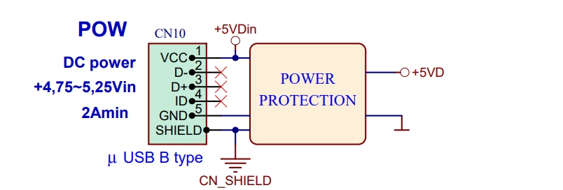
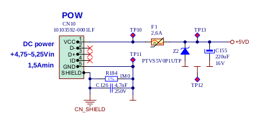

Red Pitaya STEM 125-14 Reference Manual
========================================
Red Pitaya is a Zynq7 FPGA – based low cost electronic board with many components such as two core ARM processor, fast ADCs, fast DACs, USB, LAN, etc. In many respects Red Pitaya is similar to the Arduino or Rasbery Pi with large community of enthusiasts and increasing collection of open-source material. What makes Red Pitaya even better are two fast ADCs, two fast DACs and, most of all, the programmable logic or field-programmable-gate-array (FPGA). With on-chip FPGA Red Pitaya could be used for high performance computing, state-of-the-art measurement system, signal processing and much more. Having both linux-based processing system and programmable logic Red Pitaya is an ideal board for introduction to the FPGA programming and ultimately for building powerful professional and non-professional projects such as radar, radio systems, vector-network-analyzer, etc

Features
---------

.. table::
    :widths: 10 18

    +------------------------------------+------------------------------------+
    | **Basic**                                                               |
    +====================================+====================================+
    | Processor                          | DUAL CORE ARM CORTEX A9            |
    +------------------------------------+------------------------------------+
    | FPGA                               | FPGA Xilinx Zynq 7010 SOC          |
    +------------------------------------+------------------------------------+
    | RAM                                | 512 MB (4 Gb)                      |
    +------------------------------------+------------------------------------+
    | System memory                      | Micro SD up to 32 GB               |
    +------------------------------------+------------------------------------+
    | Console connection                 | Micro USB                          |
    +------------------------------------+------------------------------------+
    | Power connector                    | Micro USB                          |
    |                                    |                                    |
    +------------------------------------+------------------------------------+
    | Power consumption                  | 5 V, 2 A max                       |
    +------------------------------------+------------------------------------+

.. table::
    :widths: 10 18

    +------------------------------------+------------------------------------+
    | **Connectivity**                                                        |
    +====================================+====================================+
    | Ethernet                           | 1 Gbit                             |
    +------------------------------------+------------------------------------+
    | USB                                | USB 2.0                            |
    +------------------------------------+------------------------------------+
    | WIFI                               | requires WIFI dongle               |
    +------------------------------------+------------------------------------+

.. table::
    :widths: 10 18

    +------------------------------------+------------------------------------+
    | **RF inputs**                                                           |
    +====================================+====================================+
    | RF input channels                  | 2                                  |
    +------------------------------------+------------------------------------+
    | Sample rate                        | 125 MS/s                           |
    +------------------------------------+------------------------------------+
    | ADC resolution                     | 14 bit                             |
    +------------------------------------+------------------------------------+
    | Input impedance                    | 1 MOhm / 10 pF                     |
    +------------------------------------+------------------------------------+
    | Full scale voltage range           | ±1 V (LV) and ±20 V (HV)           |
    +------------------------------------+------------------------------------+
    | Input coupling                     | DC                                 |
    +------------------------------------+------------------------------------+
    | Absolute max. Input voltage range  | 30 V                               |
    |                                    |                                    |
    +------------------------------------+------------------------------------+
    | Input ESD protection               | Yes                                |
    +------------------------------------+------------------------------------+
    | Overload protection                | Protection diodes                  |
    +------------------------------------+------------------------------------+
    | Bandwidth                          | DC - 60 MHz                        |
    +------------------------------------+------------------------------------+

.. table::
    :widths: 10 18

    +------------------------------------+------------------------------------+
    | **RF outputs**                                                          |
    +====================================+====================================+
    | RF output channels                 | 2                                  |
    +------------------------------------+------------------------------------+
    | Sample rate                        | 125 MS/s                           |
    +------------------------------------+------------------------------------+
    | DAC resolution                     | 14 bit                             |
    +------------------------------------+------------------------------------+
    | Load impedance                     | 50 Ohm                             |
    +------------------------------------+------------------------------------+
    | Voltage range                      | ±1 V                               |
    |                                    |                                    |
    +------------------------------------+------------------------------------+
    | Short circut protection            | Yes                                |
    |                                    |                                    |
    +------------------------------------+------------------------------------+
    | Connector type                     | SMA                                |
    +------------------------------------+------------------------------------+
    | Output slew rate                   | 2 V / 10 ns                        |
    +------------------------------------+------------------------------------+
    | Bandwidth                          | DC - 50 MHz                        |
    +------------------------------------+------------------------------------+

.. table::
    :widths: 10 18

    +------------------------------------+------------------------------------+
    | **Extension connector**                                                 | 
    +====================================+====================================+
    | Digital IOs                        | 16                                 |
    +------------------------------------+------------------------------------+
    | Analog inputs                      | 4                                  |
    +------------------------------------+------------------------------------+
    | Analog inputs voltage range        | 0-3.5 V                            |
    +------------------------------------+------------------------------------+
    | Sample rate                        | 100 kS/s                           |
    +------------------------------------+------------------------------------+
    | Resolution                         | 12 bit                             |
    +------------------------------------+------------------------------------+
    | Analog outputs                     | 4                                  |
    +------------------------------------+------------------------------------+
    | Analog outputs voltage range       | 0-1.8 V                            |
    +------------------------------------+------------------------------------+
    | Communication interfaces           | I2C, SPI, UART                     |
    +------------------------------------+------------------------------------+
    | Available voltages                 | +5 V, +3.3 V, -4 V                 |
    +------------------------------------+------------------------------------+
    | external ADC clock                 |  yes                               |
    +------------------------------------+------------------------------------+

.. table::
    :widths: 10 18

    +------------------------------------+------------------------------------+
    | **Synchronisation**                                                     |
    +====================================+====================================+
    | Trigger input                      | Through extension connector        |
    +------------------------------------+------------------------------------+
    | Daisy chain connection             | Over SATA connection               |
    |                                    | (up to 500 Mbps)                   |
    +------------------------------------+------------------------------------+
    | Ref. clock input                   | N/A                                |
    +------------------------------------+------------------------------------+

Advanced On-Board components:
----------------------------

* `ADC <https://www.analog.com/en/products/ltc2145-14.html>`_
* `DAC <https://www.analog.com/en/products/AD9767.html>`_
* `FPGA (Zynq 7010) <https://docs.xilinx.com/v/u/en-US/ds190-Zynq-7000-Overview>`_
* `DC-DC converter <https://www.analog.com/en/products/LTC3615.html>`_
* `Oscillator <https://eu.mouser.com/datasheet/2/417/bf-8746.pdf>`_
* `SRAM-DDR3 <https://www.digikey.com/en/products/detail/micron-technology-inc/MT41J256M16HA-125-E/4315785>`_
* `QSPI <https://www.infineon.com/cms/en/product/memories/nor-flash/standard-spi-nor-flash/quad-spi-flash/s25fl128sagnfi001/>`_

Power
------
To ensure optimal performance and stability of the Red Pitaya, the following power-related items are essential:

-Power Supply: 5 V / 2 A micro USB power supply.

Note:
*It's crucial to power the Red Pitaya boards with the recommended power supply. Using a power supply that provides less power than specified or has very thin power wires can result in abnormal behavior of the device, leading to unexpected reboots and network disconnections. Similarly, powering the Red Pitaya board directly from a PC's USB or a HUB that cannot provide sufficient power, or using a subpar power cable, can also lead to these issues.*

Powering Red Pitaya through extension connector
--------------------------------------------------------

The Red Pitaya can also be powered through pin 1 of the extension connector :ref:`E2 <E2>`, but in such a case, external protection must be provided by the user in order to protect the board!

Protection circuit between +5 V that is provided over the micro USB power connector and +5 VD that is connected to pin1 of the extension connector :ref:`E2 <E2>`

Status LED description
----------------------

    ======  ==========================================================================================================
    color
    ======  ==========================================================================================================
    blue    FPGA bitstream status (in normal operation, this LED is turned on, indicating the FPGA bitstream
            was successfully loaded).
    green   power supply status (in normal operation, this LED is turned on, indicating that all power supplies
            on Red Pitaya are working properly)
    red     The heartbeat blinking pattern should show CPU load (in normal operation, this LED is blinking).
    orange  SD card access indicator (In normal operation, this LED blinks in slow intervals).   
    ======  ==========================================================================================================

Analog inputs
--------------
The Red Pitaya board analog front-end features 2 fast analog inputs. 

+---------------------------------+-----------------------------------------------+
| Number of channels              | 2                                             |
+---------------------------------+-----------------------------------------------+
| Sample rate                     | 125 Msps                                      |
+---------------------------------+-----------------------------------------------+
| ADC resolution                  | 14 bits                                       |
+---------------------------------+-----------------------------------------------+
| Input coupling                  | DC                                            |
+---------------------------------+-----------------------------------------------+
| | **Absolute maximum input**    | **30 V (S) (1500 V ESD)**                     |
| | **voltage rating**            |                                               |
+---------------------------------+-----------------------------------------------+
| Overload protection             | protection diodes                             |
|                                 | (under the input voltage rating conditions)   |
+---------------------------------+-----------------------------------------------+
| Connector type                  | SMA                                           |
+---------------------------------+-----------------------------------------------+
| Input stage voltage ranges      | | LV (±1 V)                                   |
|                                 | | HV (±20 V)                                  |
+---------------------------------+-----------------------------------------------+
| Bandwidth                       | 50 MHz (3 dB)                                 |
+---------------------------------+-----------------------------------------------+
    
    .. note::
    
       The overload protection is valid for low-frequency signals. For input signals that contain frequency components beyond 1 kHz, the full-scale value defines the maximum admissible input voltage.
    

    .. note::
    
        The SMA connectors on the cables connected to Red Pitaya must correspond to the standard MIL­C­39012. The central pin must be of suitable length, otherwise, the SMA connector installed in Red Pitaya will mechanically damage the SMA connector.
        The central pin of the SMA connector on Red Pitaya will lose contact with the board and the board will not be possible to repair due to the mechanical damage (separation of the pad from the board).

.. _jumper_pos:

Jumpers
********

Voltage ranges are set by input jumpers, as shown here:

.. figure:: Jumper_settings.png 

Gain can be adjusted independently for both input channels. The adjustment is done by bridging the jumpers located behind the corresponding input SMA connector.
     
.. figure:: Jumper_settings_photo.png
            
    Jumper setting
    
    - The left setting (LV) adjusts to ± 1 V full scale.
    - The right setting (HV) adjusts to ± 20 V full scale.

.. warning::
    
    Jumper settings are limited to the described positions. Any other configuration or use of different jumper types may damage the product and void the warranty.

Input stage schematics
************************

.. figure:: Fast_analog_inputs_sch.png
        
    Fast analog inputs schematics

Analog outputs
---------------

The Red Pitaya board analog front-end features two fast analog outputs.

General Specifications
**********************

+---------------------------------+-----------------------------------------------+
| Number of channels              | 2                                             |
+---------------------------------+-----------------------------------------------+
| Sample rate                     | 125 Msps                                      |
+---------------------------------+-----------------------------------------------+
| DAC resolution                  | 14 bits                                       |
+---------------------------------+-----------------------------------------------+
| Output coupling                 | DC                                            |
+---------------------------------+-----------------------------------------------+
| Load impedance                  | 50 Ω                                          |
+---------------------------------+-----------------------------------------------+
| Full scale power                | > 9 dBm                                       |
+---------------------------------+-----------------------------------------------+
| Connector type                  | SMA                                           |
+---------------------------------+-----------------------------------------------+
| Output slew rate limit          | 200 V/us                                      |
+---------------------------------+-----------------------------------------------+
| Bandwidth                       | 50 MHz (3 dB)                                 |
+---------------------------------+-----------------------------------------------+

.. note::

    The output channels are designed to drive 50 Ω loads. Terminate outputs when channels are not used. Connect a 50 Ω parallel load (SMA Tee junction) in high-impedance load applications.

.. note::

    The typical power level with 1 MHz sine is 9.5 dBm. Output power is subject to slew rate limitations.
    
.. note::

    The SMA connectors on the cables connected to Red Pitaya must correspond to the standard MIL­C­39012. The central pin must be of a suitable length, otherwise, the SMA connector, installed on the Red Pitaya, will mechanically damage the SMA connector. The central pin of the SMA connector on the Red Pitaya will lose contact with the board and the board will not be possible to repair due to the mechanical damage (separation of the pad from the board).
    
.. figure:: Outputs.png
       
    Output channel Output voltage range: ± 1 V
        
The output stage is shown in the picture below.
    
.. figure:: Outputs_stage.png
       
    Output channel schematics
           

Output impedance
************************

The impedance of the output channels (output amplifier and filter) is shown in the figure below.
    
.. figure:: Output_impedance.png
    
    Output impedance

Bandwidth
************************

+---------------------------------+-----------------------------------------------+
| Bandwidth                       | 50 MHz (3 dB)                                 |
+---------------------------------+-----------------------------------------------+

Bandwidth measurements are shown in the picture below. Measurements are taken with the |Agilent MSO7104B| oscilloscope for each frequency step (10 Hz – 60 MHz) of the measured signal. The Red Pitaya board OUT1 is used with 0 dBm output power. The second output channel and both input channels are terminated with 50 Ohm termination. The Oscilloscope ground is used to ground the Red Pitaya board. The oscilloscope input must be set to 50 Ohm input impedance.

.. figure:: Fast_Analog_Outputs_Bandwidt.png

Extension Connector
--------------------
  - Connector: 2 x 26 pins IDC (M) 
    - Power supply: 
    - Available voltages: +5 V, +3.3 V, -3.4 V 
    - Current limitations: 500 mA for +5 V and +3.3 V (to be shared between extension module and USB devices), 50 mA 
      for -3.4 V supply. 

.. _E1:

Extension connector E1
************************

- 3v3 power source
- 16 single ended or 8 differential digital I/Os with 3.3 V logic levels

===  =========== =============== ======================== ==============
Pin  Description FPGA pin number FPGA pin description     Voltage levels
===  =========== =============== ======================== ==============
1    3V3  
2    3V3
3    DIO0_P      G17             IO_L16P_T2_35 (EXT TRIG) 3.3V
4    DIO0_N      G18             IO_L16N_T2_35            3.3V
5    DIO1_P      H16             IO_L13P_T2_MRCC_35       3.3V
6    DIO1_N      H17             IO_L13N_T2_MRCC_35       3.3V
7    DIO2_P      J18             IO_L14P_T2_AD4P_SRCC_35  3.3V
8    DIO2_N      H18             IO_L14N_T2_AD4N_SRCC_35  3.3V
9    DIO3_P      K17             IO_L12P_T1_MRCC_35       3.3V
10   DIO3_N      K18             IO_L12N_T1_MRCC_35       3.3V
11   DIO4_P      L14             IO_L22P_T3_AD7P_35       3.3V
12   DIO4_N      L15             IO_L22N_T3_AD7N_35       3.3V
13   DIO5_P      L16             IO_L11P_T1_SRCC_35       3.3V
14   DIO5_N      L17             IO_L11N_T1_SRCC_35       3.3V
15   DIO6_P      K16             IO_L24P_T3_AD15P_35      3.3V
16   DIO6_N      J16             IO_L24N_T3_AD15N_35      3.3V
17   DIO7_P      M14             IO_L23P_T3_35            3.3V
18   DIO7_N      M15             IO_L23N_T3_35            3.3V
19   NC
20   NC
21   NC
22   NC
23   NC
24   NC
25   GND
26   GND
===  =========== =============== ======================== ==============

All DIOx_y pins are LVCMOS33, with the following abs. max. ratings:
    - min. -0.40V
    - max. 3.3V + 0.55V
    - <8 mA drive strength
    
.. _E2:

Extension connector E2
************************

    - +5 V & -3V4 power source
    - SPI, UART, I2C
    - 4 x slow ADCs
    - 4 x slow DACs
    - Ext. clock for fast ADC
 
.. Table 6: Extension connector E2 pin description

===  ====================== =============== ==================== ==============
Pin  Description            FPGA pin number FPGA pin description Voltage levels
===  ====================== =============== ==================== ==============
1    +5V                                                                         
2    -3.4V (50mA)\ :sup:`1`                                                                         
3    SPI(MOSI)              E9              PS_MIO10_500         3.3V
4    SPI(MISO)              C6              PS_MIO11_500         3.3V
5    SPI(SCK)               D9              PS_MIO12_500         3.3V
6    SPI(CS#)               E8              PS_MIO13_500         3.3V
7    UART(TX)               C8              PS_MIO08             3.3V
8    UART(RX)               C5              PS_MIO09             3.3V
9    I2C(SCL)               B9              PS_MIO50_501         3.3V
10   I2C(SDA)               B13             PS_MIO51_501         3.3V
11   Ext com.mode                                                GND (default)
12   GND                                                       
13   Analog Input 0                                              0-3.5V
14   Analog Input 1                                              0-3.5V
15   Analog Input 2                                              0-3.5V
16   Analog Input 3                                              0-3.5V
17   Analog Output 0                                             0-1.8V
18   Analog Output 1                                             0-1.8V
19   Analog Output 2                                             0-1.8V
20   Analog Output 3                                             0-1.8V
21   GND                                                       
22   GND                                                       
23   Ext Adc CLK+                                                LVDS
24   Ext Adc CLK-                                                LVDS
25   GND                                                       
26   GND                                                       
===  ====================== =============== ==================== ==============

\ :sup:`1` Red Pitaya Version 1.0 has -3.3V on pin 2. Red Pitaya Version 1.1 has -3.4V on pin 2.

Schematics of extension connectors are shown in the picture below.

.. figure:: Extension_connector.png

Auxiliary analog input channels
*******************************
    
    - Number of channels: 4 
    - Nominal sampling rate: 100 ksps (H) 
    - ADC resolution 12 bits 
    - Connector: dedicated pins on IDC connector :ref:`E2 <E2>` (pins 13,14,15,16) 
    - Input voltage range: 0 to +3.5 V 
    - Input coupling: DC 

Auxiliary analog output channels 
*******************************

    - Number of channels: 4 
    - Output type: Low pass filtered PWM (I) 
    - PWM time resolution: 4 ns (1/250 MHz)
    - Connector: dedicated pins on IDC connector :ref:`E2 <E2>` (pins 17,18,19,20) v - Output voltage range: 0 to +1.8 V 
    - Output coupling: DC 

General purpose digital input/output channels: (N) 
**************************************************************

    - Number of digital input/output pins: 16 
    - Voltage level: 3.3 V 
    - Direction: configurable 
    - Location: IDC connector :ref:`E1 <E1>` (pins 324) 

External ADC clock
-------------------

The ADC clock can be provided by:

    * On board 125 MHz XO (default)
    * From an external source/through extension connector :ref:`E2 <E2>` (R25, R26 should be moved to location R23, R24)
    * Directly from the FPGA (R25, R26 should be relocated to R27, R28) 

.. figure:: External_clk.png
    :alt: Logo
    :align: center

    Schematic
    

.. warning::

    We do not advise altering the board because users have reported problems after doing so. Every board made has undergone rigorous testing, which cannot be claimed for modified boards. Any non-Red Pitaya hardware modification will void the warranty, and we cannot guarantee support for modified boards.

Cooling options
----------------

For additional cooling, we recommend a 30 mm or 25 mm fan. You can use the board's power connector to power the fan, but please note that it supplies only 5 V. The power connector is located between the micro-SD socket and the host USB connector.

.. figure:: cooling-powerPin.jpg
    :width: 50%
    :align: center

    Red Pitaya power connector. Image via `blog <https://rroeng.blogspot.com/2014/03/keep-your-red-pitaya-cool.html>`_ (with permission from Jacek Radzikowski).

.. note::

    The power connector is a standard 2-pin 0.1" connector.
    Supplies only 5 V.

Setting up serial console
--------------------------

The debug console can be used to follow the boot process:

1. FSBL (if debug mode is enabled)

   The serial console can also be used to see the output 
   of other bare metal applications, for example, the memory test.

2. U-Boot

   During the boot process, U-Boot will show status and debug information.

   After FSBL starts U-Boot, there is a 3-second delay
   before U-Boot starts the Linux kernel.
   If during this time a key is pressed,
   U-boot will stop the boot process
   and give the user access to its shell.

3. Linux console

   During the boot process, Linux will show status and debug information.

   When ``systemd`` reaches ``multi-user.target`` a login prompt will appear.

      User name: ``root``
      Password: ``root``

|More detailed guide for serial console|
.. |More detailed guide for serial console| raw:: html

   <a href="https://redpitaya.readthedocs.io/en/latest/developerGuide/software/console/console/console.html" target="_blank">More detailed guide for serial console</a>

Hardware setup
***************

.. note::

   For STEMlab 125-14, you need an additional USB to micro USB cable; for STEMlab 125-10, you need an additional serial to USB adapter (the pins need to be soldered).

.. figure:: console-connector.png

Connect your Red Pitaya and PC with a micro USB B to USB A cable and follow the instructions for your OS.

.. figure:: pitaya-USB-connection-300x164.png

Software - Advanced Vivado Design Suite Integration for Red Pitaya
-------------------------------------------------------------------
The Red Pitaya seamlessly integrates with Xilinx’s cutting-edge Vivado® Design Suite, optimized for high-performance FPGA development. Vivado brings to the table a plethora of modern tools and design methodologies 

that elevate and streamline contemporary design processes. It boasts enhanced speed, optimizes FPGA resource utilization, and empowers designers to invest their efforts in exploring diverse design possibilities. 
The System Edition is enriched with an embedded logic analyzer, a state-of-the-art high-level synthesis tool, among other avant-garde utilities, ensuring that Red Pitaya-based designs are crafted with precision and efficiency.

FPGA Configuration
-------------------
The Red Pitaya offers a robust FPGA configuration process, allowing developers to harness the full potential of the onboard FPGA. This section provides a comprehensive guide on the building process, ensuring seamless integration and deployment.

Available Projects:
********************
The Red Pitaya supports various projects tailored for specific boards. Notable projects include 0.94, 0.94_250, stream_app, logic, tft, axi4lite, and classic. Each project is compatible with specific Red Pitaya models, ensuring optimized performance.

Setting Up the Environment:
****************************************
**Vivado Configuration**: On a PC with Vivado installed, configure system variables by sourcing the appropriate settings64.sh files from the Vivado and SDK directories. This setup ensures the $PATH environment variable is correctly set.

**Git Installation**: Ensure Git command line tools are installed on your computer. This is essential for downloading the Red Pitaya codebase.

**Red Pitaya Codebase**: Create a directory for the Red Pitaya code and clone the repository using git clone https://github.com/RedPitaya/RedPitaya.git.

Building the FPGA:
****************************************
**Nonproject Mode**: Red Pitaya employs a nonproject mode for FPGA building, avoiding the generation of numerous project files. This approach ensures only source files and scripts are under version control.

**TCL Scripts**: Various TCL scripts are available to facilitate different tasks, from creating the bitstream and reports to generating device tree sources. Navigate to the FPGA directory within the Red Pitaya repository to execute these scripts.

**Vivado GUI**: To generate and open a Vivado project using the GUI, use the make project command followed by the project name and model flag. This process creates a new project, associating all necessary Red Pitaya files. Developers can then add or modify Verilog modules and integrate them into the design.

**Bitstream Generation**: After synthesis and implementation, the resulting .bit file is located within the project directory. This file should be copied to /opt/redpitaya/fpga on the Red Pitaya device for deployment.

SSH Access
------------
Red Pitaya supports SSH (Secure Shell) access, which allows users to establish a secure connection to the device. This is particularly useful for developers and advanced users who wish to execute commands directly on the Red Pitaya's operating system. This allows:

-Secure Communication: SSH ensures that all communication between the user and the Red Pitaya device is encrypted, ensuring data integrity and confidentiality.

-Remote Management: With SSH, users can remotely log into the Red Pitaya, execute commands, and manage the device. This is particularly useful for developers and advanced users who wish to perform tasks directly on the Red Pitaya's operating system without physical access.

-File Transfer: SSH also supports secure file transfer protocols, allowing users to securely transfer files to and from the Red Pitaya.

To Access SSH follow these steps:

-Windows 10: Windows 10 users can utilize the built-in SSH client. To access Red Pitaya via SSH, open the Command Prompt or PowerShell and enter the command ssh root@rp-xxxxxx.local, where rp-xxxxxx is the Red Pitaya's hostname.

-Linux/MacOS: Users of Linux or MacOS can access Red Pitaya via the terminal using the same SSH command.

Programming via JTAG
----------------------
Red Pitaya offers a streamlined process for programming directly from Xilinx Vivado using a JTAG cable. This guide uses the Red Pitaya STEMlab 125-14, Ubuntu 20.04, Vivado 2020.1, and the Digilent JTAG-HS3 cable with a 14 to 6-pin adapter, complemented by the Digilent Adept 2 software.

JTAG Cable Selection
*********************
An appropriate JTAG cable is essential. This guide employs the Digilent JTAG-HS3 cable with a 14 to 6-pin adapter. However, the Digilent JTAG-HS2 is also suitable, offering a 6-pin connector for direct connection to Red Pitaya’s JTAG. For an exhaustive list of JTAG cables supported by Vivado, consult Xilinx UG908 - Programming and Debugging, appendix D. Link to Xilinx UG908 https://www.xilinx.com/content/dam/xilinx/support/documentation/sw_manuals/xilinx2021_2/ug908-vivado-programming-debugging.pdf

Cable Detection
*****************

In Ubuntu, use: **$ lsusb**   ----> JTAG-HS3 appears as an FTDI device.

Digilent Adept 2
*****************
Install the Digilent Adept 2 software from Digilent's official site. Ensure both Utilities and Runtime are installed. If GUI installation fails, use the command:  **$ sudo dpkg -i <path to package>**

For Digilent cables, verify adapter detection with: $ djtgcfg enum

Vivado Configuration:
*********************

-Launch Vivado 2020.1.
-Navigate to Program and Debug -> Open Target -> Auto Connect.
-A Xilinx-compatible JTAG cable should appear in the Hardware window, under localhost.
-Connect the JTAG cable to Red Pitaya’s JTAG connector. Pin markings are on the Red Pitaya’s PCB bottom side.
-A Xilinx device, such as xc7z010_1, should now be visible in Vivado.
-Click on "Program Device".
-Upon selecting a valid bitfile, Red Pitaya is ready for programming.

Simulation
**********
Use ModelSim from Altera. Address path issues in Ubuntu with:

**$ ln -s $HOME/intelFPGA/16.1/modelsim_ase/linux $HOME/intelFPGA/16.1/modelsim_ase/linux_rh60**
**$ sudo apt install libxft2:i386**

Navigate to FPGA/sim and run:  **$ make top_tb**

Building Red Pitaya Ecosystem
------------------------------
The Red Pitaya ecosystem is an integral environment designed for the seamless development and deployment of applications on the Red Pitaya board. This section offers guidance on setting up and building the ecosystem.

Ecosystem Setup
****************

-Clone the Repository: Start by obtaining the Red Pitaya repository using the command: **git clone https://github.com/RedPitaya/RedPitaya.git**.
-Directory Navigation: Proceed to the ecosystem directory within the repository with: **cd RedPitaya/ecosystem**.
-Docker Build: To ensure a consistent build environment, use Docker with the command: **make**.

Deployment
*************
After building the ecosystem, it's ready for deployment to the Red Pitaya board. Ensure the board shares a network connection with your PC.

-IP Address Configuration: Define your Red Pitaya's IP address by replacing 192.168.1.100 in the command: **export REDPITAYA_IP=192.168.1.100**.
-Ecosystem Deployment: Deploy the ecosystem using: **make install**.

It's crucial to note that specific Red Pitaya OS versions might be compatible with particular ecosystem versions. Always refer to the Red Pitaya documentation and release notes to ensure compatibility.

SPI Interface
**************
The Serial Peripheral Interface (SPI) is a synchronous serial communication interface used for short-distance communication, primarily in embedded systems. Red Pitaya provides an SPI interface, allowing users to communicate with various peripheral devices. SPI is a full-duplex interface, meaning it can transmit and receive data simultaneously. It uses a master-slave architecture, where the master device controls the data flow by generating a clock signal.

Red Pitaya SPI Configuration
******************************

Red Pitaya offers a flexible SPI configuration, allowing users to interface with a variety of devices. The SPI pins are accessible via the extension connector E1. Users can configure the SPI mode, clock frequency, and other parameters to match the connected peripheral device.
The SPI interface on Red Pitaya can be employed for various applications, including:

-Reading data from sensors.
-Communicating with external memory modules.
-Interfacing with display modules or ADCs.

Red Pitaya provides a set of tools and libraries to facilitate SPI communication. Users can configure the SPI parameters, initiate data transfers, and manage the connected devices efficiently.

Certificates
-------------

Besides the functional testing, Red Pitaya passed the safety and electromagnetic compatibility (EMC) tests at an
external |testing and certification institute|.

.. |testing and certification institute| raw:: html

    <a href="http://www.siq.si/?L=3" target="_blank">testing and certification institute</a>

|Certificates|

.. |Certificates| raw:: html
    <a href="https://redpitaya.readthedocs.io/en/latest/developerGuide/hardware/125-14/cets.html" target="_blank">Certificates</a>
    

Product comparison table
------------------------

.. table::
    :widths: 10 18 18 18 18 18 18
    :align: center

    +------------------------------------+------------------------------------+------------------------------------+------------------------------------+------------------------------------+------------------------------------+------------------------------------+
    | Basic                                                                                                                                                                                                                                                            |
    +====================================+====================================+====================================+====================================+====================================+====================================+====================================+
    |                                    | STEMlab 125-10 |br|                | STEMlab 125-14 |br|                | STEMlab 125-14-Z7020-LN            | STEMlab 125-14 4-Input             | SDRlab 122-16  |br|                | SIGNALlab 250-12                   |
    |                                    | (discontinued)                     | STEMlab 125-14 LN |br|             |                                    |                                    | SDRlab 122-16 ext. clk             |                                    |
    |                                    |                                    | STEMlab 125-14 ext. clk            |                                    |                                    |                                    |                                    |
    +------------------------------------+------------------------------------+------------------------------------+------------------------------------+------------------------------------+------------------------------------+------------------------------------+
    | Processor                          | DUAL CORE ARM CORTEX A9            | DUAL CORE ARM CORTEX A9            | DUAL CORE ARM CORTEX A9            | DUAL CORE ARM CORTEX A9            | DUAL CORE ARM CORTEX A9            | DUAL CORE ARM CORTEX A9            |
    +------------------------------------+------------------------------------+------------------------------------+------------------------------------+------------------------------------+------------------------------------+------------------------------------+
    | FPGA                               | FPGA Xilinx Zynq 7010 SOC          | FPGA Xilinx Zynq 7010 SOC          | FPGA Xilinx Zynq 7020 SOC          | FPGA Xilinx Zynq 7020 SOC          | FPGA Xilinx Zynq 7020 SOC          | FPGA Xilinx Zynq 7020 SOC          |
    +------------------------------------+------------------------------------+------------------------------------+------------------------------------+------------------------------------+------------------------------------+------------------------------------+
    | RAM                                | 256 MB (2 Gb)                      | 512 MB (4 Gb)                      | 512 MB (4 Gb)                      | 512 MB (4 Gb)                      | 512 MB (4 Gb)                      | 1 GB (8 Gb)                        |
    +------------------------------------+------------------------------------+------------------------------------+------------------------------------+------------------------------------+------------------------------------+------------------------------------+
    | System memory                      | Micro SD up to 32 GB               | Micro SD up to 32 GB               | Micro SD up to 32 GB               | Micro SD up to 32 GB               | Micro SD up to 32 GB               | Micro SD up to 32 GB               |
    +------------------------------------+------------------------------------+------------------------------------+------------------------------------+------------------------------------+------------------------------------+------------------------------------+
    | Console connection                 | USB to serial converter required   | Micro USB                          | Micro USB                          | Micro USB                          | Micro USB                          | USB-C                              |
    +------------------------------------+------------------------------------+------------------------------------+------------------------------------+------------------------------------+------------------------------------+------------------------------------+
    | Power connector                    | Micro USB                          | Micro USB                          | Micro USB                          | Micro USB                          | Micro USB                          | Power Jack |br|                    |
    |                                    |                                    |                                    |                                    |                                    |                                    | RJ45 (PoE version only)            |
    +------------------------------------+------------------------------------+------------------------------------+------------------------------------+------------------------------------+------------------------------------+------------------------------------+
    | Power consumption                  | 5 V, 1, 5 A max                    | 5 V, 2 A max                       | 5 V, 2 A max                       | 5 V, 2 A max                       | 5 V, 2 A max                       | 24 V, 0.5 A max                    |
    +------------------------------------+------------------------------------+------------------------------------+------------------------------------+------------------------------------+------------------------------------+------------------------------------+

.. table::
    :widths: 10 18 18 18 18 18 18
    :align: center

    +------------------------------------+------------------------------------+------------------------------------+------------------------------------+------------------------------------+------------------------------------+------------------------------------+
    | Connectivity                                                                                                                                                                                                                                                     |
    +====================================+====================================+====================================+====================================+====================================+====================================+====================================+
    |                                    | STEMlab 125-10 |br|                | STEMlab 125-14 |br|                | STEMlab 125-14-Z7020-LN            | STEMlab 125-14 4-Input             | SDRlab 122-16  |br|                | SIGNALlab 250-12                   |
    |                                    | (discontinued)                     | STEMlab 125-14 LN |br|             |                                    |                                    | SDRlab 122-16 ext. clk             |                                    |
    |                                    |                                    | STEMlab 125-14 ext. clk            |                                    |                                    |                                    |                                    |
    +------------------------------------+------------------------------------+------------------------------------+------------------------------------+------------------------------------+------------------------------------+------------------------------------+
    | Ethernet                           | 1 Gbit                             | 1 Gbit                             | 1 Gbit                             | 1 Gbit                             | 1 Gbit                             | 1 Gbit                             |
    +------------------------------------+------------------------------------+------------------------------------+------------------------------------+------------------------------------+------------------------------------+------------------------------------+
    | USB                                | USB 2.0                            | USB 2.0                            | USB 2.0                            | USB 2.0                            | USB 2.0                            | 2 x USB 2.0                        |
    +------------------------------------+------------------------------------+------------------------------------+------------------------------------+------------------------------------+------------------------------------+------------------------------------+
    | WIFI                               | requires WIFI dongle               | requires WIFI dongle               | requires WIFI dongle               | requires WIFI dongle               | requires WIFI dongle               | requires WIFI dongle               |
    +------------------------------------+------------------------------------+------------------------------------+------------------------------------+------------------------------------+------------------------------------+------------------------------------+

.. table::
    :widths: 10 18 18 18 18 18 18
    :align: center

    +------------------------------------+------------------------------------+------------------------------------+------------------------------------+------------------------------------+------------------------------------+------------------------------------+
    | RF inputs                                                                                                                                                                                                                                                        |
    +====================================+====================================+====================================+====================================+====================================+====================================+====================================+
    |                                    | STEMlab 125-10 |br|                | STEMlab 125-14 |br|                | STEMlab 125-14-Z7020-LN            | STEMlab 125-14 4-Input             | SDRlab 122-16  |br|                | SIGNALlab 250-12                   |
    |                                    | (discontinued)                     | STEMlab 125-14 LN |br|             |                                    |                                    | SDRlab 122-16 ext. clk             |                                    |
    |                                    |                                    | STEMlab 125-14 ext. clk            |                                    |                                    |                                    |                                    |
    +------------------------------------+------------------------------------+------------------------------------+------------------------------------+------------------------------------+------------------------------------+------------------------------------+
    | RF input channels                  | 2                                  | 2                                  | 2                                  | 4                                  | 2                                  | 2                                  |
    +------------------------------------+------------------------------------+------------------------------------+------------------------------------+------------------------------------+------------------------------------+------------------------------------+
    | Sample rate                        | 125 MS/s                           | 125 MS/s                           | 125 MS/s                           | 125 MS/s                           | 122.88 MS/s                        | 250 MS/s                           |
    +------------------------------------+------------------------------------+------------------------------------+------------------------------------+------------------------------------+------------------------------------+------------------------------------+
    | ADC resolution                     | 10 bit                             | 14 bit                             | 14 bit                             | 14 bit                             | 16 bit                             | 12 bit                             |
    +------------------------------------+------------------------------------+------------------------------------+------------------------------------+------------------------------------+------------------------------------+------------------------------------+
    | Input impedance                    | 1 MOhm / 10 pF                     | 1 MOhm / 10 pF                     | 1 MOhm / 10 pF                     | 1 MOhm / 10 pF                     | 50 Ohm                             | 1 MOhm                             |
    +------------------------------------+------------------------------------+------------------------------------+------------------------------------+------------------------------------+------------------------------------+------------------------------------+
    | Full scale voltage range           | ±1 V (LV) and ±20 V (HV)           | ±1 V (LV) and ±20 V (HV)           | ±1 V (LV) and ±20 V (HV)           | ±1 V (LV) and ±20 V (HV)           | 0.5 Vpp/-2 dBm                     | +-1 V/+-20 V (software selectable) |
    +------------------------------------+------------------------------------+------------------------------------+------------------------------------+------------------------------------+------------------------------------+------------------------------------+
    | Input coupling                     | DC                                 | DC                                 | DC                                 | DC                                 | AC                                 | AC / DC (software selectable)      |
    +------------------------------------+------------------------------------+------------------------------------+------------------------------------+------------------------------------+------------------------------------+------------------------------------+
    | Absolute max. Input voltage range  | 30 V                               | 30 V                               | 30 V                               | 30 V                               | DC max 50 V (AC-coupled)           | 30 V                               |
    |                                    |                                    |                                    |                                    |                                    | 1 Vpp for RF                       |                                    |
    +------------------------------------+------------------------------------+------------------------------------+------------------------------------+------------------------------------+------------------------------------+------------------------------------+
    | Input ESD protection               | Yes                                | Yes                                | Yes                                | Yes                                | Yes                                | Yes                                |
    +------------------------------------+------------------------------------+------------------------------------+------------------------------------+------------------------------------+------------------------------------+------------------------------------+
    | Overload protection                | Protection diodes                  | Protection diodes                  | Protection diodes                  | Protection diodes                  | DC voltage protection              | Protection diodes                  |
    +------------------------------------+------------------------------------+------------------------------------+------------------------------------+------------------------------------+------------------------------------+------------------------------------+
    | Bandwidth                          | DC - 50 MHz                        | DC - 60 MHz                        | DC - 60 MHz                        | DC - 60 MHz                        | 300 kHz - 550 MHz                  | DC - 60 MHz                        |
    +------------------------------------+------------------------------------+------------------------------------+------------------------------------+------------------------------------+------------------------------------+------------------------------------+

.. table::
    :widths: 10 18 18 18 18 18 18
    :align: center

    +------------------------------------+------------------------------------+------------------------------------+------------------------------------+------------------------------------+------------------------------------+------------------------------------+
    | RF outputs                                                                                                                                                                                                                                                       |
    +====================================+====================================+====================================+====================================+====================================+====================================+====================================+
    |                                    | STEMlab 125-10 |br|                | STEMlab 125-14 |br|                | STEMlab 125-14-Z7020-LN            | STEMlab 125-14 4-Input             | SDRlab 122-16 |br|                 | SIGNALlab 250-12                   |
    |                                    | (discontinued)                     | STEMlab 125-14 LN |br|             |                                    |                                    | SDRlab 122-16 ext. clk             |                                    |
    |                                    |                                    | STEMlab 125-14 ext. clk            |                                    |                                    |                                    |                                    |
    +------------------------------------+------------------------------------+------------------------------------+------------------------------------+------------------------------------+------------------------------------+------------------------------------+
    | RF output channels                 | 2                                  | 2                                  | 2                                  | N/A                                | 2                                  | 2                                  |
    +------------------------------------+------------------------------------+------------------------------------+------------------------------------+------------------------------------+------------------------------------+------------------------------------+
    | Sample rate                        | 125 MS/s                           | 125 MS/s                           | 125 MS/s                           | N/A                                | 122.88 MS/s                        | 250 MS/s                           |
    +------------------------------------+------------------------------------+------------------------------------+------------------------------------+------------------------------------+------------------------------------+------------------------------------+
    | DAC resolution                     | 10 bit                             | 14 bit                             | 14 bit                             | N/A                                | 14 bit                             | 14 bit                             |
    +------------------------------------+------------------------------------+------------------------------------+------------------------------------+------------------------------------+------------------------------------+------------------------------------+
    | Load impedance                     | 50 Ohm                             | 50 Ohm                             | 50 Ohm                             | N/A                                | 50 Ohm                             | 50 Ohm                             |
    +------------------------------------+------------------------------------+------------------------------------+------------------------------------+------------------------------------+------------------------------------+------------------------------------+
    | Voltage range                      | ±1 V                               | ±1 V                               | ±1 V                               | N/A                                | 0.5 Vpp/ -2 dBm                    | +-2 V / +-10 V (Hi-Z load)         |
    |                                    |                                    |                                    |                                    |                                    | (50 Ohm load)                      | (software selectable)              |
    +------------------------------------+------------------------------------+------------------------------------+------------------------------------+------------------------------------+------------------------------------+------------------------------------+
    | Short circut protection            | Yes                                | Yes                                | Yes                                | N/A                                | N/A, RF transformer                |                                    |
    |                                    |                                    |                                    |                                    |                                    | & AC-coupled                       | Yes                                |
    +------------------------------------+------------------------------------+------------------------------------+------------------------------------+------------------------------------+------------------------------------+------------------------------------+
    | Connector type                     | SMA                                | SMA                                | SMA                                | N/A                                | SMA                                | BNC                                |
    +------------------------------------+------------------------------------+------------------------------------+------------------------------------+------------------------------------+------------------------------------+------------------------------------+
    | Output slew rate                   | 2 V / 10 ns                        | 2 V / 10 ns                        | 2 V / 10 ns                        | N/A                                | N/A                                | 10 V / 17 ns                       |
    +------------------------------------+------------------------------------+------------------------------------+------------------------------------+------------------------------------+------------------------------------+------------------------------------+
    | Bandwidth                          | DC - 50 MHz                        | DC - 50 MHz                        | DC - 50 MHz                        | N/A                                | 300 kHz - 60 MHz                   | DC - 60 MHz                        |
    +------------------------------------+------------------------------------+------------------------------------+------------------------------------+------------------------------------+------------------------------------+------------------------------------+

.. table::
    :widths: 10 18 18 18 18 18 18
    :align: center

    +------------------------------------+------------------------------------+------------------------------------+------------------------------------+------------------------------------+------------------------------------+------------------------------------+
    | Extension connector                                                                                                                                                                                                                                              |
    +====================================+====================================+====================================+====================================+====================================+====================================+====================================+
    |                                    | STEMlab 125-10                     | STEMlab 125-14 |br|                | STEMlab 125-14-Z7020-LN            | STEMlab 125-14 4-Input             | SDRlab 122-16 |br|                 | SIGNALlab 250-12                   |
    |                                    |                                    | STEMlab 125-14 LN |br|             |                                    |                                    | SDRlab 122-16 ext. clk             |                                    |
    |                                    |                                    | STEMlab 125-14 ext. clk            |                                    |                                    |                                    |                                    |
    +------------------------------------+------------------------------------+------------------------------------+------------------------------------+------------------------------------+------------------------------------+------------------------------------+
    | Digital IOs                        | 16                                 | 16                                 | 16                                 | 20                                 | 16                                 | 16                                 |
    +------------------------------------+------------------------------------+------------------------------------+------------------------------------+------------------------------------+------------------------------------+------------------------------------+
    | Analog inputs                      | 4                                  | 4                                  | 4                                  | 4                                  | 4                                  | 4                                  |
    +------------------------------------+------------------------------------+------------------------------------+------------------------------------+------------------------------------+------------------------------------+------------------------------------+
    | Analog inputs voltage range        | 0-3.5 V                            | 0-3.5 V                            | 0-3.5 V                            | 0-3.5 V                            | 0-3.5 V                            | 0-3.5 V                            |
    +------------------------------------+------------------------------------+------------------------------------+------------------------------------+------------------------------------+------------------------------------+------------------------------------+
    | Sample rate                        | 100 kS/s                           | 100 kS/s                           | 100 kS/s                           | 100 kS/s                           | 100 kS/s                           | 100 kS/s                           |
    +------------------------------------+------------------------------------+------------------------------------+------------------------------------+------------------------------------+------------------------------------+------------------------------------+
    | Resolution                         | 12 bit                             | 12 bit                             | 12 bit                             | 12 bit                             | 12 bit                             | 12 bit                             |
    +------------------------------------+------------------------------------+------------------------------------+------------------------------------+------------------------------------+------------------------------------+------------------------------------+
    | Analog outputs                     | 4                                  | 4                                  | 4                                  | 4                                  | 4                                  | 4                                  |
    +------------------------------------+------------------------------------+------------------------------------+------------------------------------+------------------------------------+------------------------------------+------------------------------------+
    | Analog outputs voltage range       | 0-1.8 V                            | 0-1.8 V                            | 0-1.8 V                            | 0-1.8 V                            | 0-1.8 V                            | 0-1.8 V                            |
    +------------------------------------+------------------------------------+------------------------------------+------------------------------------+------------------------------------+------------------------------------+------------------------------------+
    | Communication interfaces           | I2C, SPI, UART                     | I2C, SPI, UART                     | I2C, SPI, UART                     | I2C, SPI, UART                     | I2C, SPI, UART                     | I2C, SPI, UART, USB                |
    +------------------------------------+------------------------------------+------------------------------------+------------------------------------+------------------------------------+------------------------------------+------------------------------------+
    | Available voltages                 | +5 V, +3.3 V, -4 V                 | +5 V, +3.3 V, -4 V                 | +5 V, +3.3 V, -4 V                 | +5 V, +3.3 V, -4 V                 | +5 V, +3.3 V, -4 V                 | +5 V, +3.3 V, -4 V                 |
    +------------------------------------+------------------------------------+------------------------------------+------------------------------------+------------------------------------+------------------------------------+------------------------------------+
    | external ADC clock                 | N/A                                |  yes                               |  yes                               |  yes                               |  yes                               | yes                                |
    +------------------------------------+------------------------------------+------------------------------------+------------------------------------+------------------------------------+------------------------------------+------------------------------------+

.. table::
    :widths: 10 18 18 18 18 18 18
    :align: center

    +------------------------------------+------------------------------------+------------------------------------+------------------------------------+------------------------------------+------------------------------------+------------------------------------+
    | Synchronisation                                                                                                                                                                                                                                                  |
    +====================================+====================================+====================================+====================================+====================================+====================================+====================================+
    |                                    | STEMlab 125-10 |br|                | STEMlab 125-14 |br|                | STEMlab 125-14-Z7020-LN            | STEMlab 125-14 4-Input             | SDRlab 122-16 |br|                 | SIGNALlab 250-12                   |
    |                                    | (discontinued)                     | STEMlab 125-14 LN |br|             |                                    |                                    | SDRlab 122-16 ext. clk             |                                    |
    |                                    |                                    | STEMlab 125-14 ext. clk            |                                    |                                    |                                    |                                    |
    +------------------------------------+------------------------------------+------------------------------------+------------------------------------+------------------------------------+------------------------------------+------------------------------------+
    | Trigger input                      | Through extension connector        | Through extension connector        | Through extension connector        | Through extension connector        | Through extension connector        | Through BNC connector              |
    +------------------------------------+------------------------------------+------------------------------------+------------------------------------+------------------------------------+------------------------------------+------------------------------------+
    | Daisy chain connection             | N/A                                | Over SATA connection |br|          | Over SATA connection |br|          | Over SATA connection |br|          | Over SATA connection |br|          | Over SATA connection |br|          |
    |                                    |                                    | (up to 500 Mbps)                   | (up to 500 Mbps)                   | (up to 500 Mbps)                   | (up to 500 Mbps)                   | (up to 500 Mbps)                   |
    +------------------------------------+------------------------------------+------------------------------------+------------------------------------+------------------------------------+------------------------------------+------------------------------------+
    | Ref. clock input                   | N/A                                | N/A                                | N/A                                | N/A                                | N/A                                | Through SMA connector              |
    +------------------------------------+------------------------------------+------------------------------------+------------------------------------+------------------------------------+------------------------------------+------------------------------------+

.. note::

    Red Pitaya devices:

    * should be operated at normal conditions with ambient temperatures not exceeding 30°C (86°F) and should not be covered.
    * are intended for indoor use at a maximum altitude of 2000 m, pollution degree 2, and relative humidity less than 90%.
    * intended for use with low-voltage energy sources and signals; it should not be used in any direct connection with voltages above 30 volts.

.. warning::

    All inputs and outputs available through SMA and BNC connectors share a common ground connected to the power supply ground.

